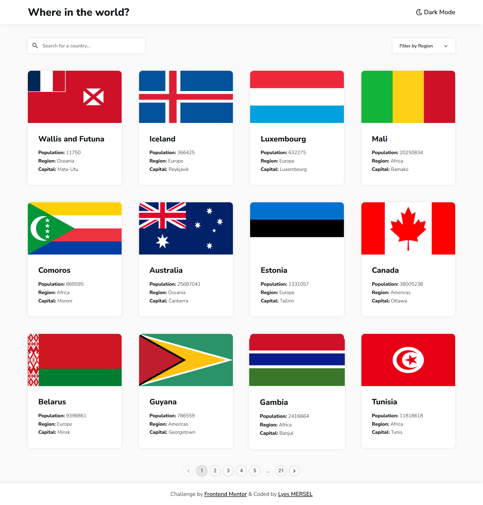
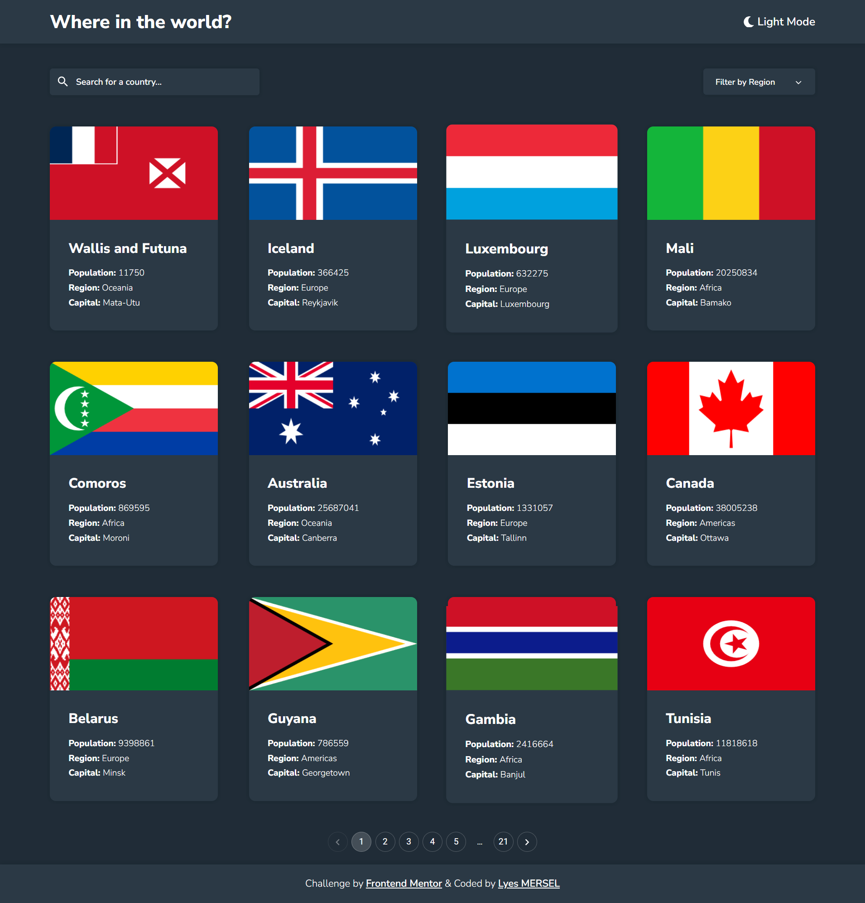
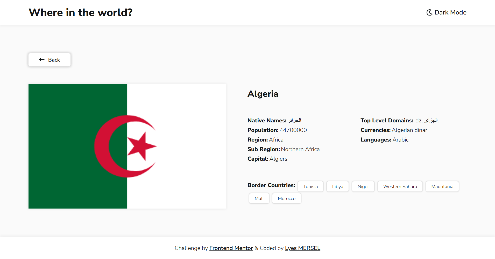
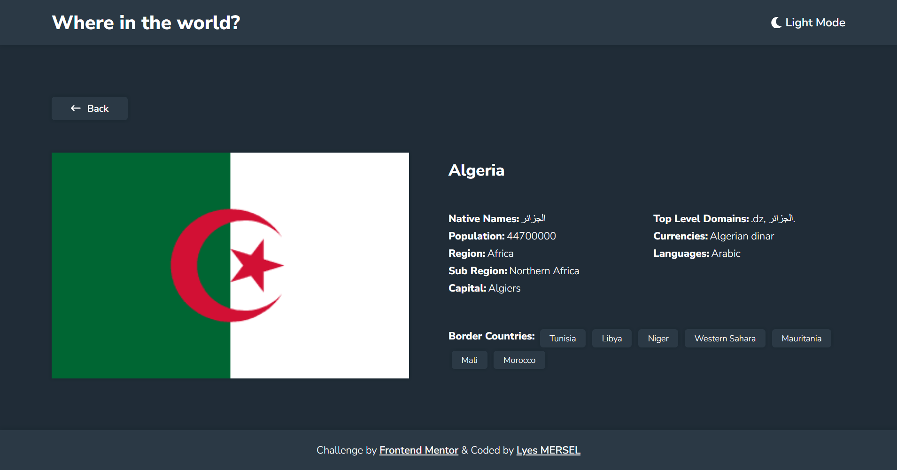
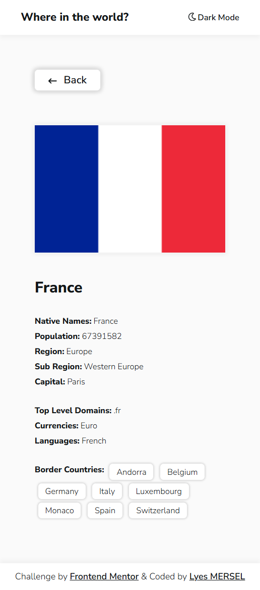
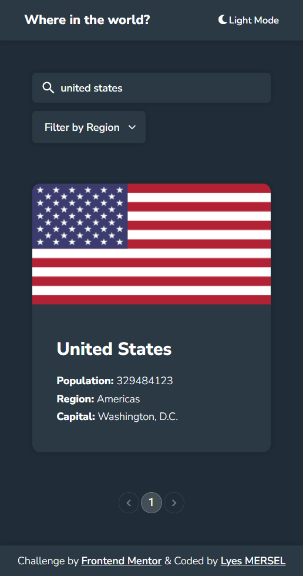

# Country Navigator
## Frontend Mentor - REST Countries API with color theme switcher solution
This is a solution to the [REST Countries API with color theme switcher challenge on Frontend Mentor](https://www.frontendmentor.io/challenges/rest-countries-api-with-color-theme-switcher-5cacc469fec04111f7b848ca).

Country Navigator is a responsive React application that uses the REST Countries API to provide a comprehensive list of countries worldwide. Users can filter countries by continent, search by name, and view detailed information by clicking on country cards. For developers, this project serves as a showcase of React best practices with a focus on responsiveness and clean, extendable code.


## Screenshots
| HomePage - Light Mode | HomePage - Dark Mode |
| -------| ------- |
|  |  |

| DetailsPage - Light Mode | DetailsPage - Dark Mode |
| -------| ------- |
|  |  |

| Mobile - DetailsPage | Mobile - HomePage |
| -------| ------- |
|  |  |


## Links
- Solution URL: [GitHub](https://github.com/lyes-mersel/countries-challenge)
- Live Site URL: [Vercel](https://countrynavigator.vercel.app/)

## Built with
- React.js
- MUI


## Installation
1. Clone the repo
   ```sh
   git clone https://github.com/lyes-mersel/country-navigator.git
   ```
2. Install NPM packages
   ```sh
   npm install
   ```
3. Launch the server
   ```sh
   npm run dev
   ```


## Author
- Website - [Portfolio](https://lyes-mersel.netlify.app)
- Github - [@lyes-mersel](https://github.com/lyes-mersel)
- Frontend Mentor - [@lyes-mersel](https://www.frontendmentor.io/profile/lyes-mersel)
- LinkedIn - [@lyes-mersel](https://www.linkedin.com/in/lyes-mersel/)


# Made with ❤️
